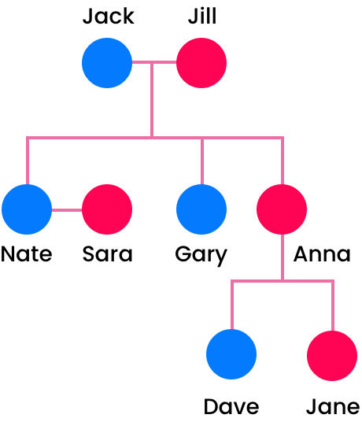

# Family tree

This challenge will evaluate how you approach solving a real-world problem and your object oriented fundamentals.

## The problem

Write code to build the provided tree.

* You can use any language you like.
* You should be able to add a child to any node in the tree through the mother.



## Format required for input and output

We recommend input and output via a terminal however, you can choose to use other ways if you prefer e.g a web form.

#### Sample input & output

As an example to add "Dave" to the tree you would run the following command:

```ADD_TO "mothers_name" "childs_name" "gender"```
ADD_TO Anna Dave Male

## Final considerations

* We must be able to run your solution.
* Outputting the tree structure after each insert is a bonus.
* Make sure you add a README file. 
* We recommend you spend 1 to 2 hours at most on this problem.

## Submission

Please email a link to your fork of this repository to `jonny@milkchoc.com.au`.
