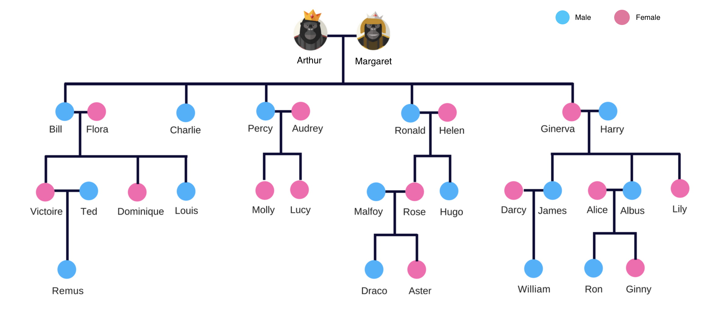

# Family tree

This challenge will evaluate how you approach solving a real-world problem and your object oriented fundamentals. Getting the output correct is important but how you write the code is the most important aspect of this test.

## The problem

Write code to model the provided family tree so that:

* Given a `name` and a `relationship`, output the people corresponding to the relationship.
* You should be able to add a child to any node in the tree through the mother.



## Format required for input and output

We recommend that input and output occur via a terminal. However, you can choose to use other ways if you prefer however the output should be printed clearly for evaluation.

#### Sample input & output

The format to add a child is:

```ADD_CHILD "Mother’s-Name" "Child's-Name" "Gender"```

The format to query a relationship is:

```GET_RELATIONSHIP "Name" "Relationship"```

Here are some examples of tests to help implement the solution:

| Input | Output |
--------|--------|
ADD_CHILD Ginerva John Male | CHILD_ADDITION_SUCCEEDED
GET_RELATIONSHIP Ginny Paternal-Uncle | James John
GET_RELATIONSHIP Darcy Brother-In-Law | Albus John
ADD_CHILD Luna Lola Female | PERSON_NOT_FOUND
GET_RELATIONSHIP Luna Maternal-Aunt | PERSON_NOT_FOUND
ADD_CHILD Ted Bella Female | CHILD_ADDITION_FAILED
GET_RELATIONSHIP Remus Siblings | NONE
GET_RELATIONSHIP Lily Sister-In-Law | Darcy Alice

## Relationships to handle

These are the relationships we should be able to find:

* **Son**
* **Daughter**
* **Siblings**
* **Paternal-Uncle:** Father's brother
* **Maternal-Uncle:** Mother's brother
* **Paternal-Aunt:** Father's sister
* **Maternal-Aunt:** Mother's Sister
* **Sister-In-Law:** Spouse's sister, Wives of siblings
* **Brother-In-Law:** Spouse's brothers, Husbands of siblings


## Final considerations

* We must be able to run your solution.
* Make sure you add a README file. 
* If we cannot run the solution it will affect your evaluation.
* We recommend you do not spend more than 6 hours on this problem.
* If you do not implement all scenarios that is OK.

## Submission

Please email a link to your fork of this repository to `jonny@milkchoc.com.au`.
